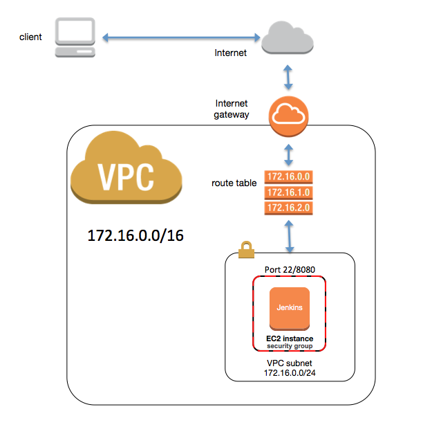

## Overview

This is a simple demo showing how to spinning up an aws instance on EC2 with Jenkins setup. The network structure is as following:

From here, you can further:
* converted this into a cluster by adding ASG and ELB. 
* use templating tool such as Packer to create an AMI and save on S3, then provision with terraform

### Tools used in this project

* Terraform - orchestration tool to provision servers and network on aws 
* Puppet - configuration tool to provision Jenkins
* Jenkins CLI - interacting with Jenkins to create user account

## Environment Setup

We need install `go` and `terraform`:

* Install go (required by Terraform)
** `brew install go`
* [Install terraform](https://www.terraform.io/downloads.html)

## Prerequisite for AWS

* You have to have full access of EC2 (for provisioning) and S3 (for saving terraform state)
* You generate a EC2 key pair named *JenkinsKeyPair* (or others, then you need change *vars.tf* file), and save private key to */path/to/JenkinsKeyPair.pem* with permission `400`.
* You need update *modules/terraform.tfvars* file to your aws access key and secret key, plus the private key path.
 
## To Run

Please refer to `modules/ec/run.sh`. 

* To initialize, use `run.sh init`.
* To apply, use `run.sh apply`. When finish, it should print the dns of the jenkins server. You can copy and paste that to browser, e.g., http://ec2-12-34-56-78.compute-1.amazonaws.com:8080. The default user is `alexli`, and password is `password`. 
* To destroy(do NOT forget), use `run.sh destroy`

## Terraform graph

Follow the basics of Unix Philosophy: Design for visibility to make inspection and debugging easier.

The following is the graph output from terraform:

## References
* [Amazon EC2 AMI locator for Unbuntu](https://cloud-images.ubuntu.com/locator/ec2/)
* [Amzaon Linux AMI IDs](https://aws.amazon.com/amazon-linux-ami/)
* [A better way of visualizing microservice architecture](https://articles.microservices.com/an-alternative-way-of-visualizing-microservice-architecture-837cbee575c1)